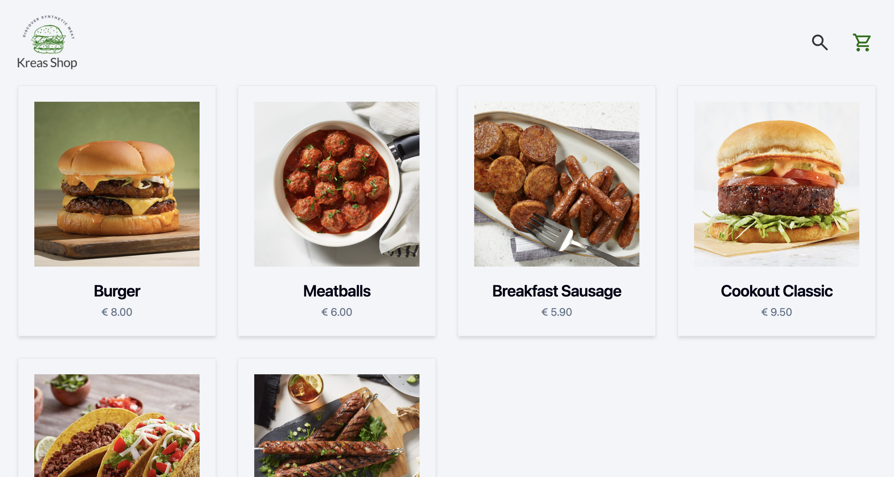
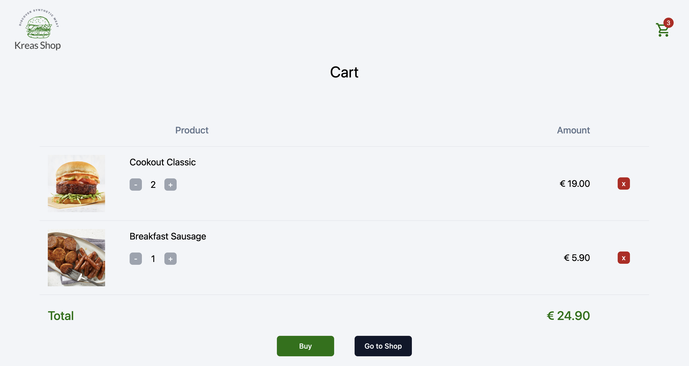

# Kreas Shop


## Description

This project reproduces the functioning of a hypothetical synthetic meat shop, with the product search function and shopping cart. It was developed with Vue.js in Typescript.



## Installation

If you're using OS X or Windows, use one of the installers from the
 [Node.js download page](https://nodejs.org/en/download/). LTS versions of
  Node.js are recommended.

Clone Github repo:

```bash
git clone https://github.com/Gio-Mex/kreas-shop.git
```

Install package:

```bash
npm install
```
Now run `ng serve` for a dev server. Navigate to http://localhost:5173/
`ng build` only executes the builder for the build target in the default project
 as specified in package.json. 

## Usage 
When you open the app, a gallery of hypothetical products loads.  
You can use the magnifying glass at the top right to open the dialog and enter the name of a product to search for: if present in the product list it will be displayed.  
Selecting a product will open the details page where you can add it to your cart.  
In the cart you can change the quantity of a product, delete it, or simulate the purchase.



## Demo
Try the app [here](https://vue-kreas-shop.netlify.app).